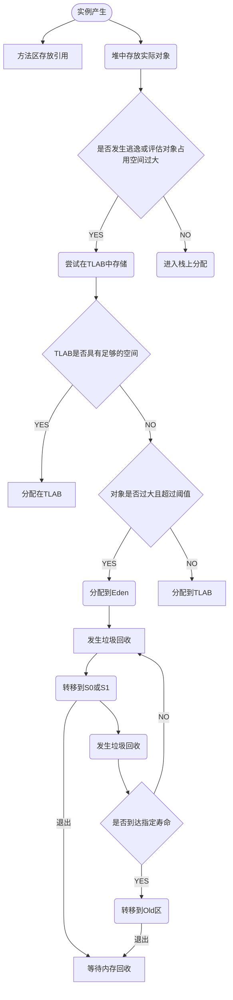
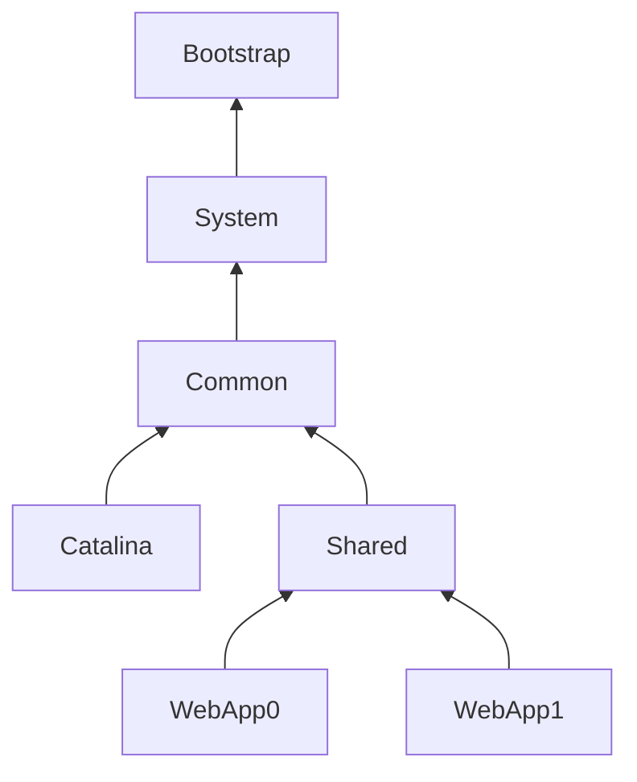

> 
>
> 首先，如果需要真正深入了解jvm的内部情况，可以登录java的官网下载对应版本的[规范](https://docs.oracle.com/javase/specs/index.html "规范")，可下载对应的pdf文件做详细了解。也可以阅读《深入理解Java虚拟机：JVM高级特性与最佳实践》。

> 本文主要为读者描绘jvm的大致情况，方便读者在之后的学习中有方向性地了解更细节的内容。主要基于当前常用的JAVA8。

> java虚拟机规范并不是关于虚拟机的实现，而是介绍了一些规则，因此读者会发现为什么虚拟机还有什么hotspot之类。并且由于虚拟机对应的时class文件，因此其它语言可以依赖自己的编译器获得一个可以运行在java虚拟机上的文件。

<table><tr><td bgcolor=yellow>本文内容较杂，但由浅入深，将各部分知识敲碎再组合。适合一次性读完。</td></tr></table>

[TOC]

### 1. 虚拟机主要内容

- 首先，从代码运行开始，虚拟机需要加载class文件，此时需要依赖类加载器。
  
  1. 由于类既有Java自带的类，还有用户定义的类，以及一些特殊场景下需要特别照顾的类。
  
  2. 于是，虚拟机内部包含多种类加载器，同时用户也可以为特殊场景定义自己的类加载器。

- 在类加载之后，就到了内存之中。内存管理则是一个大内容。
  
  - 首先，宏观上，内存包含了以下两类，公有区和私有区：
    - <font color=Blue>公有区：</font>
      
        1. 堆(heap)
        2. 元空间【方法区（这是逻辑概念】(MetaSpace)
    - <font color=Blue>私有区：</font>
      1. 虚拟机栈
      2. 本地方法栈
      3. 程序计数器
  - 其次，垃圾回收器（GC)用于垃圾对象占用内存的回收
    
    - <font color=Orange>垃圾回收算法</font>
    
    - <font color=Orange>现有主流垃圾回收器</font>
  
- 对象创建流程
  
  - 首先将对应的class文件内容加载到方法区中，【在hotspot中，先生成一个对应的c++对象，之后在堆中生成实际的java对象】
    - 实际上，对象名在调用对象时，首先指向c++对象，该对象中包含着对Java对象的指针。
  - java对象的保存是在堆中，但内部仍然包含一系列选择，包含栈存储，TLAB，Eden,S1/S0,Old

### 2. 类加载

#### 2.1 简要概述

所谓类加载，是指将class文件加载到内存中，由JVM对数据做校验、解析、初始化，最终得到java类型。而class文件本身是按照规范的一组指令的有序集合。

> 类加载是在运行期间完成，而不是c++那种提前编译，导致运行效率相对低，但是由此我们可以在运行期间对class文件做操作，更具灵活性和扩展性。例如cglib的动态代理，就是在运行期间完成一个代理对象的class实现并加载的内存中替代原有对象，实现功能增强。
> 更厉害的是，Alibaba的arthas软件，可以在项目运行期间，替换其中的某个class文件【避免小问题导致的项目整体停止】，这些是提前编译完全做不到的。

------------------------------------------------------------已有的类加载器-------------------------------------------------------------------------

```text
BootstrapClassLoader(最底层)【实际是由c++实现的(针对hotspot)】
ExtClassLoader（扩展类）
AppClassLoader
```

例如，我们希望创建一个HashMap的对象，由于这种属于jdk较为底层的类，不是你开发者可以随便搞的，也算不上是扩展的，就需要交由BootstrapClassLoader负责创建，类似地，不同层级的类由对应的加载器负责。
如此划分，加载器能够各司其职，防止底层的类被后来的类覆盖。同时，如果项目过大，包含了众多的依赖或模块，出现多个类的全限定名相同，这一机制能保证只有一个类能实现，而不是出现多个造成歧义。

> 各加载器的加载路径获得方式：
> BootstrapClassLoader：System.getProperty("sun.boot.class.path")

> ExtClassLoader：System.getProperty("java.ext.dirs")
> AppClassLoader:System.getProperty("java.class.path")

> 通过路径可获悉不同加载器负责的类的范围。其中ext可以在本地安装路径中的jre\lib\ext中看到不少jar文件。

#### 2.2 加载过程

> 类的加载需要先查找现有的类，再创建没有的类

每个加载器有自己的缓存保存已创建的类。
当一个类需要加载时，首先到达AppClassLoader中，由它查找自身管理的类中是否有现成，则直接返回，否则询问ExtClassLoader，由它再查找它管理的类中是否有现成的，类似地，到达bootBootstrapClassLoader，当发现没有的现成的，它将看看这个类是否是由它负责的，则创建并返回，否则把任务交给ExtClassLoader，类似地，再传递给AppClassLoader，总会在这里创建出来的。
---------这一过程被称为双亲委派机制【就是可以向上或向下踢皮球】

>  *双亲委派机制只是JVM的一种推荐做法，实际的一些实现可能有自己的加载方式，可以了解一下Tomcat的方式，所有的类都会自行加载，只有实现不了才会委派上层完成。*

> 如果学习过spring系列，或操作过动态代理的同学，估计会注意到有时参数需要传递一个类的class对象或赋予一个类加载器作为参数。
> 即使用方法getclassloader()获得，通过这个方法可以获悉对象是由哪个加载的，进一步的getParent()可以得知加载器的上层是哪个。但是在查询ExtClassLoader的父加载器时，返回的是null【因为前文告知了，hotspot最底层的加载器是c++实现的，没有对应的java代码】（常用的JVM多是HotSpot，它本身是c++编写的，而其它JVM，如MRP、Maxine是Java编写的，对应的bootstrap则不为null)
> 
> 【BootstrapClassLoader是与对应的JVM为一个整体，而其它类加载器则属于后来者】

另外加载器可以实现自定义，jdk中关于加载器的定义的是：

1. 除bootstrap】均继承自ClassLoader抽象类
2. 下面有SecureClassLoader实现类
3. 再下面有URLClassLoader类
4. 再下面就有了AppClassLoader、ExtClassLoader类，可以继承自上面的类自定义加载器。

<font color=Red>【需要注意的是，类的继承关系，和踢皮球的关系可不相同，新定义的类加载器无论继承自谁，它的parent都是AppClassLoader。】</font>

### 3. 内存管理

这里主要先介绍内存的各个组成部分的作用。

#### 3.1 内存公有区

- 元空间（方法区）：方法区本身是逻辑概念，相当于接口，是由永久代或元空间实现出来的，，由于这个区域没有垃圾回收，因此可以适当调大一些，防止报OutOfMemoryError：Java heap space。
  
  - 主要负责存储：类信息、常量、运行时常量池、静态常量、即时编译器编译后的代码

- 堆：包含多个部分，Eden、S0/S1(From Survior,To SUrvior)、Old(老年代)。主要存储实例对象，包括数组之类的。【-Xmx,-Xms负责调节堆的大小】
  
  - 实例对象生成后，将放在堆中，位置顺序是，Eden->S0<-->S1->老年代。

> ~~jdk1.7实现的方法区称为永久代，1.8则实现为元空间，本质上是与堆保存在一起，但概念上有所差别（jdk1.7合并给堆）【1.7之前，hotSpot称之为永久代】，如果需要调整该区域的内存大小，可用jvm命令【-XX:MaxMetaspaceSize=..】（这是1.8的命令，之前的版本估计也没人在乎）~~

堆的内存分配比例：

<table border="0" bordercolor="black" width="300" cellspacing="0" cellpadding="0"><tr><td >老年代</td><td colspan="3">新生代</td></tr><tr><td >2/3</td><td colspan="3">1/3</td></tr><tr><td></td><td>Eden</td><td>S0</td><td>S1</td></tr><tr><td></td><td>80%</td><td>10%</td><td>10%</td></tr></table>

#### 3.2 内存私有区

由于现在的系统以及程序要求多线程，导致需要为不同的线程分配特有的空间进行独立运行。于是，需要分出这样一块内存用于划分成多个独立的小块。

每个小块内部包含虚拟机栈、本地方法栈以及程序计数器。

- 虚拟机栈：本身是一个栈，内部保存的是进程的局部变量和临时结果。内部每个方法又有独立的栈帧。
  
  - 栈帧内部包含：局部变量表，返回地址（方法结束位置），操作数栈，动态链接。
    1. 局部变量表中，引用类型保存为对应实例的地址。变量表由变量槽（slot）为单位计算大小。
    2. 操作数栈，用于执行方法对变量的计算操作。不过是将变量表中的数据进行入栈/出栈操作。（栈的运行深度有限制，否则产生StackOverFlowError，主要取决于给定的内存大小，可通过命令-Xss指定内存大小，IDEA中，可在运行配置中找到VM option选项填写命令，更多常用的配置命令可看一下[阿里的文档](https://help.aliyun.com/document_detail/148851.html)）
    3. 动态链接，其它方法在运行时常量池中的地址，用于方法调用。
    4. 若栈在运行期间需要扩展时，发现无法提供足够的空间，则会产生OutOfMemoryError。
- 本地方法栈:这个栈实际与虚拟机栈是非常类似的，虽然给出了差别介绍，但实际的jvm将二者视为一体。只是，Java中有些内部的方法或可以自定义一些方法，它们的底层实现可以是其它语言，Java中有一些底层方法是由C/C++实现，并在方法前标记为native方法。包含这类native方法的将交由本地方法栈负责

【虚拟机栈和本地方法栈有时直接统称Java栈】

### 4. 垃圾回收器（GC）

GC的内容的内容较多，内部包含很多机制和算法，但真正需要做的就是对利用回收器做调优。

- 首先，判断垃圾
  
  1. 这是一个非常老掉牙的知识点：主要是，最初有一个引用计数法，当一个实例对象的身上带有的引用数量不为0，则代表它仍有用，则不视为垃圾，<font color=Red >但实际上可以有垃圾抱团的现象</font>；实际使用的<font color=Blue>根可达性方法</font>，由于程序的运行通常从一个main方法作为入口进入，那么从这个入口开始，内部开始产生多个对象（这里我们姑且称之为main对象），而这些对象之后可能会使用另外一些对象，如调用一些外部方法之类的，总之，之后产生的所有对象都与这些main对象有着引用关系。
  2. jvm内部保存着所有的对象，从main对象开始，按照引用关系，一步步向下搜索，只要被搜索到，即视为有用的对象，而其它对象自然是垃圾。

- 识别到垃圾对象后，需要做的就是回收垃圾
  
  - 实际的垃圾回收，也是一个老掉牙的知识点了。1、标记清除：顾名思义地，直接回收垃圾的内存，但造成大量内存碎片。2、复制清除：耗费内存，直接将原有的内存划为两半，一半将另一半有用的对象直接复制过来，对面的内存直接变成整个空闲内存。3、标记压缩：标记清除的同时，将碎片整理起来，速度慢。
    
    > ~~需要告知的是，由于回收垃圾可能会影响程序的运行效率，jvm并不是发现垃圾就回收，即使有一些方法表面意思是释放对象内存，也只是做个样子，只有在内存真的紧张时，才可能出发垃圾回收机制~~

- 垃圾回收器：
  
  1. 经典垃圾回收器：Serial、ParNew、Parallel Scavenge、Serial Old、CMS、Garbage First(G1)
  2. 低延迟垃圾回收器：Shenandoah、ZGC
  3. Epsilon

- 新生/老年代：在jdk1.8及之前，是做上述堆的划分的。经典回收器也是基于此作相应的设计。
  
  - 新生代就是前面提及的Eden、S0/S1，当对象创建初期大多放在这里
  - 老年代就是Old喽！只要对象活得够久或空间够大就可以放在这里。

--------------------------------------------------------------------

### 5. 对象存储

<font color=Orange>首先要注意，类产生的对象和作为数组的对象在创建机理上是不同的。类对象有类加载器一层层负责，而数组则直接由Bootstrap负责。</font> 【在JVM规范中，指出了底层的实现中，类对象使用了常用的new，而数组则有自己的newarray等方法】

#### 5.1 实例存储

- 虽然过程有所区别，但经历了加载机制和创建过程后，最终都产生了相应的实例对象，并将实例存放在堆【正常来说】中。



对象创建后，具体的存储流程如上图。

> 首先是，试图放在方法栈中，其次考虑TLAB，最后分配到熟悉的Eden,S0/S1,Old区。

下面简单介绍一下上述的一些过程细节：

- 为了提高效率，首先试图将对象放在栈中，这里的栈为方法栈。但首先不能过大，否则存不下；其次，由于对象是相应的方法产生的，改对象需要在此对象的控制之下，而不能被其它外部的变量调用，否则则发生了逃逸。
  - 由于是放在方法栈中，对象会随着方法的结束而结束，不需要GC，但是发生逃逸则导致方法结束了，对象不应该结束。则破坏了栈的结构。
- TLAB(Thread Local Allocation Buffer)【本地分配缓存区】，是线程在Eden区预留的一块内存，空间非常小。
  - 如果对象够小，且有足够的空间，就直接放在这里。
    - 这里还设置了一个阈值，只要超过，就省去中间的环节，直接放在Old区。
    - 较大但还可以的，则放在Eden区。
- Eden区是一个新对象的集中区，基本上新产生的实例都放在这里，而新的实例大多也短命。在系统触发了垃圾回收机制后，仍存活的实例就转移到S0或S1中。
- S0/S1，是遵循复制清除的垃圾处理机制，S0/S1就是被一份为二的内存。每次触发了垃圾回收机制，双方就进行转移。
  - 并且，每经历依此垃圾回收，或者的实例的寿命就+1。直到到达指定的寿命，实例就会转移到Old区【这里寿命，一般为15】。

#### 5.2 对象定位

对象的定位，自然需要获取它在内存中的地址，而这个地址则放在Java栈的本地变量表中，但真正获取到对象，这里有两种方式：【为了得到完善的对象信息，我们一方面要获得对象在堆中的数据信息，另一方面要获得方法区中对象的类型信息】

- 句柄访问：这是一种间接方式，堆中可能划分出一块内存作为句柄池，而本地变量表中的地址则指向这个句柄池。句柄池中包含了我们需要的两个信息的指针。【这个方法较慢，但好处在于变量表与实际对象地址是解耦合的，尤其在复制清除算法中，避免了频繁修改变量表中的值】
- 指针访问：这个方法符合我们的预期，它首先指向堆中的对象数据信息，而其中包含了指向方法区中对象类型信息的指针，再到达方法区获取类信息。【这个方法很快，也是hotspot的主要方式】

> 由于hotspot底层为c++，需要创造一种数据结构来描述java类与对象的信息。 hotspot中对于类及其对象的描述使用OOP-Klass模型【OOP(Ordinary Object Pointer)描述实例信息，Klass描述类信息，是与对应java类相关的c++对等体】

- OOP一定程度上包含了java对象的地址信息
- Klass则是一个抽象基类，描述了对应Java类的信息

OOP-Klass导致了在hotspot的底层上，调用实例的过程实际上是先到达c++的对等体上，获得了Java对象的地址，再到达堆中实例的位置。【更多关于OOP-Klass模型的信息，可参考附录14.2】

### 6. 垃圾回收算法


### 7. Class文件结构


### 8. 类加载过程

>  前文介绍的双亲委派机制，这一机制是jdk1.2之后引入的推荐方法，而不是强制的，具体的实现代码在java.lang.ClassLoader中的loadClass()方法中。

#### 8.1 类的初始化

- 另外在加载之后，需要进行连接，这里包含了三个步骤【验证、准备、解析】，之后进行初始化，才能开始使用，如果任务结束，则对类进行卸载。<font color=Red>其中，为了效率，连接中的一些操作会在加载阶段同步进行</font>，其中的步骤也不是完全具有先后顺序。

这里需要注意的是其中的初始化问题，何时需要真正初始化一个类，首先必须有一个类的情况下则必须初始化，如：

1. new一个对象，使用类的静态字段或方法。反射调用一个类。还有一个是动态语言生成的方法句柄需初始化对应的类。
2. 由于对象的继承关系，首先需要初始化其父类。或程序的main函数所在的类也必须初始化。
3. 特别的，由于jdk8后接口存在default方法，继承此接口的类初始化，必定带动这个接口初始化。

【特别的例子说明】

- 如果B继承了A，且二者内部均有各自的静态代码，例如A中有静态变量a,B中有静态语句输出。如果调用了B.a，此时并不会返回B中的静态输出，即没有实现B的初始化（但有可能完成了加载、验证）。
  - 因为此时，我们仅需要的是A的静态变量，B虽然出场了，但我们既然开始初始化了A，B是否存在就不重要了，导致B的类不是必须的。
- 如果我们定义了一个B类型的数组，实际也还是不会有所输出。我们当前只是完成了数组的分配，相当于盖房子，入住手续后面可以进行，没那么急。而且，这个定义的数组本质上也是一个类，是一个继承自Object由JVM自动生成的关于B的类，内部包装了数组操作。
- 类似地，如果A中的静态变量是一个常量，那么调用A.a时，A是不会初始化的。因为在编译期间，这些常量已提前放到了常量池中。此时这个变量和A有关系，但又不完全有关系。

#### 8.2 类的加载

前一节提前说了一下类的初始化，但这一切的开头都需要类的加载。

- 加载过程：由全限定名称获取字节流，转化为方法区内的运行时数据结构、生成一个java.lang.Class对象作为该类的访问接口。

其中的字节流可以通过一切手段获得。例如网络、jar包、数据库等。

> 其中的jar包读取，在对应的位置字符串中指明对应的协议和jar包位置，再接上“!/"表明读取包内的文件，之后就是接上对应jar包内文件的位置。如”jar:file:\\\【jar包位置】!/【文件位置】“

前文中提及了如果有需要的话，可以自定义类加载器。现在，我们就可以继承URLClassLoader，再覆盖对应的类加载方法，包括从哪里读取类文件(其中，就可以用上述jar包读取的方式从自定义的jar包中读取自己的class文件并加载到内存中)。

如果我们有多个类似的jar包，但是内部class文件的代码逻辑有所差别【类似于人类的双标行为】，此时就可以通过自定义的类加载器，视情况加载不同的jar包。

<font color=Red>【需要注意数组】</font>

需要说明一下数组的组件类型，即数组去掉一个维度后的类型，如String[] 组件类型就是String，而String[][] \[ ][ ]的组件类型就是String[]。

首先，数组不同于普通java对象，它是直接由JVM创建 ，而不是类加载器完成。就如前面的【特别的例子说明】中提及的，数组是被JVM直接创建了一个对应的类。

1. 如果组件类型是String这类的非引用型的，那么就直接焦雷BootstrapClassLoader进行创建。
2. 否则，就仍然是个数组的引用，
   - java8的虚拟机规范中介绍是：此时数组被标记为已由组件类型的定义类加载器定义。
     - 但之后，被去掉一个维度的数组再次进入这样一个加载流程中，不断地被去掉一个维度，并不断地被标记，直到最后不再是引用类型，到达BootstrapClassLoader进行创建。

### 9. 对象结构

对象的头结构

#### 9.1 对象存储结构


#### 9.2 指针压缩

64位过长，给我们寻址带宽和对象内引用造成了负担

什么负担？往下看！

同一个对象存在堆里会花费更多的空间！！！！

口说无凭，首先我们计算下同一个对象在不同操作系统的堆中存放的大小


**对象头**
32位系统，占用 8 字节(markWord4字节+kclass4字节)
64位系统，开启 UseCompressedOops(压缩指针)时，占用 12 字节，否则是16字节(markWord8字节+kclass8字节，开启时markWord8字节+kclass4字节)
**实例数据**
boolean 1
byte 1
short 2
char 2
int 4
float 4
long 8
double 8
**引用类型**
32位系统占4字节 (因为此引用类型要去方法区中找类信息,所以地址为32位即4字节同理64位是8字节)
64位系统，开启 UseCompressedOops时，占用4字节，否则是8字节
**对齐填充**
如果对象头+实例数据的值不是8的倍数，那么会补上一些，补够8的倍数

32位操作系统 花费的内存空间为
**对象头-8字节 + 实例数据 int类型-4字节 + 引用类型-4字节+补充0字节(16是8的倍数) 16个字节**

64位操作系统
**对象头-16字节 + 实例数据 int类型-4字节 + 引用类型-8字节+补充4字节(28不是8的倍数补充4字节到达32字节) 32个字节**

**同样的对象需要将近两倍的容量,(实际平均1.5倍),所以需要开启压缩指针：**

64位开启压缩指针 **对象头-12字节 + 实例数据 int类型-4字节 + 引用类型-4字节+补充0字节=24个字节**
开启后可以减缓堆空间的压力(同样的内存更不容易发生oom)

**VM的实现方式是**
不再保存所有引用，而是每隔8个字节保存一个引用。例如，原来保存每个引用0、1、2…，现在只保存0、8、16…。因此，指针压缩后，并不是所有引用都保存在堆中，而是以8个字节为间隔保存引用。
在实现上，堆中的引用其实还是按照0x0、0x1、0x2…进行存储。只不过当引用被存入64位的寄存器时，JVM将其左移3位（相当于末尾添加3个0），例如0x0、0x1、0x2…分别被转换为0x0、0x8、0x10。而当从寄存器读出时，JVM又可以右移3位，丢弃末尾的0。（oop在堆中是32位，在寄存器中是35位，2的35次方=32G。也就是说，使用32位，来达到35位oop所能引用的堆内存空间）

**哪些信息会被压缩？**
1.对象的全局静态变量(即类属性)
2.对象头信息:64位平台下，原生对象头大小为16字节，压缩后为12字节
3.对象的引用类型:64位平台下，引用类型本身大小为8字节，压缩后为4字节
4.对象数组类型:64位平台下，数组类型本身大小为24字节，压缩后16字节

**哪些信息不会被压缩？**
1.指向非Heap的对象指针
2.局部变量、传参、返回值、NULL指针

总结:

在JVM中（不管是32位还是64位），对象已经按8字节边界对齐了。对于大部分处理器，这种对齐方案都是最优的。所以，使用压缩的oop并不会带来什么损失，反而提升了性能。

压缩指针32g指针失效问题

讲到这应该很明了了，因为寄存器中3的35次方只能寻址到32g左右(不是准确的32g，有可能在31g就发生指压缩失效)，所以当你的内存超过32g时，jvm就默认停用压缩指针，用64位寻址来操作，这样可以保证能寻址到你的所有内存，但这样所有的对象都会变大，实际上未开启开启后的比较，40g的对象存储个数比不上30g的存储个数

### 10. class文件加载

在实际使用中，我们当前线程的类加载默认为AppClassloader。如果我们自定义了一个类加载器从外部的jar包或其它途径读取了一组字节流加载为对应的类，由于当前默认的类加载器对这个类是不做负责的，导致我们无法直接的在代码中用普通的类形式调用相关的方法，只能通过类的newInstance()方法生成一个实例，而实例也只能通过getMethod()方法调用指定的方法，invoke读取结果中的对应数据。

可使用当前线程即Thread.currentThread().setContextClassloader()来设置当前需要的类加载器，此时就可以像正常操作那样调用类并使用，但最后作为临时操作【可放在某个方法中，临时改变方便自己的操作，最后该还原】。

#### 10.1 自定义的类加载器

下面是摘自官方文档的一些介绍：

> 支持并发加载类的类加载器称为*并行能力*类加载器，需要通过调用ClassLoader.registerAsParallelCapable方法在其类初始化时间注册自身【默认情况下， `ClassLoader`类注册为并行】（它的子类仍然需要注册自己，如果它们是并行的能力）。
> 在委托模式不是严格层次化的环境中，类加载器需要并行，否则加载类可能导致死锁，因为加载程序锁定在类加载过程中保持（参见[`loadClass`](java/java/lang/../../java/lang/ClassLoader.html#loadClass-java.lang.String-)方法）。
> 
>  方法[`defineClass`](java/java/lang/../../java/lang/ClassLoader.html#defineClass-java.lang.String-byte:A-int-int-)将字节数组转换为类别`类`的实例。 这个新定义的类的实例可以使用[`Class.newInstance`](java/java/lang/../../java/lang/Class.html#newInstance--)创建。
> 
> 类加载器创建的对象的方法和构造函数可以引用其他类。 要确定所引用的类，Java虚拟机调用最初创建该类的类加载器的[`loadClass`](java/java/lang/../../java/lang/ClassLoader.html#loadClass-java.lang.String-)方法。
> 
> 网络类加载器子类必须定义从网络加载类的方法[`findClass`](java/java/lang/../../java/lang/ClassLoader.html#findClass-java.lang.String-)和`loadClassData` 。 一旦下载构成类的字节，它应该使用方法[`defineClass`](java/java/lang/../../java/lang/ClassLoader.html#defineClass-byte:A-int-int-)创建一个类实例。 

上述的官方描述，已经说明了一个类加载中主要的方法，因此我们在自定义时只需要覆盖这些方法即可，主要的步骤包括：

1. 在findClass()中指明类的来源，使之能够读入字节流。这里的操作空间就非常大了，可以从任意地方的任意位置的任意文件中获取流，只要是能够执行的。例如，可以放在某个服务器上的某个目录下的txt文件，只要这个文件磁盘上的内容是class文件的形式即可。这样我们可以随便定义目标文件的后缀名让人无法察觉。
2. 在获取了字节流之后，findClass()方法内部需要调用一个defineClass()方法从字节流生成一个类。这也可以自主发挥一下如何搞些奇怪的手段改变字节流搞事。

大致的效果是：

自定义一个类加载器，

```java
public class MyClassLoader extends ClassLoader
{
    //省略

    protected Class<?> findClass(String name) throws ClassNotFoundException
    {
         //这里如果继承自URLClassLoader，可以使用url读取网络或本地位置的文件
        File file = new File("目录"+文件name);
        try{
            byte[] bytes = getMyClassBytes(file);//读取字节流，可自定义读取方法

            Class<?> c = this.defineClass(name, bytes, 0, bytes.length)//生成类
            return c;
        } 
        catch (Exception e)
        {
            e.printStackTrace();
        }
       //省略
    }
}
```

调用类加载器，

```java
MyClassLoader myClassLoader = new MyClassLoader(); //我们的类加载器
Class<?> clazz = Class.forName("类名", true, myClassLoader); 
Object obj = clazz.newInstance();//生成一个原始的类对象
//因为默认发类加载器中并不负责这个类，因此一旦脱离的自定义的类加载器，无法给他一个合适的名分，只能作为纯粹的对象，不能直接调用它原有的各种技能
```

另外，如果定义的类的全限定名与上层的类加载器有冲突，不希望被双亲委派机制交由上级处理，可以覆盖loadClass方法指明当对象为null时，由自定义的加载器负责创建。

```java
protected Class<?> loadClass(String name, boolean resolve)//name为类的全限定名
    throws ClassNotFoundException
{
    synchronized (getClassLoadingLock(name)) {

        Class<?> c = findLoadedClass(name);//查看缓存中是否已存在对应的类
        if (c == null) {
            /*try {
                if (parent != null) {
                    c = parent.loadClass(name, false);
                } else {
                    c = findBootstrapClassOrNull(name);
                }
            } catch (ClassNotFoundException e) {
                   e.printStackTrace();
            }*/
            //上述为常用的双亲委派机制
            //我们这里不希望委派
            if (c == null) {
                //直接调用自己的方法生成类
                c = findClass(name);
            }
        }
       //略
        return c;
    }
}
```

----------------------------

----------------------------------------==<font color=Blue>【疲倦的话，稍微缓一缓吧！】</font>==----------------------------------

---------------------------------

#### 10.2 类的验证

在获得了类的字节流后，首先需要判断这是不是一个合格的类文件。

验证操作主要有：格式验证、语义分析、操作验证，以及符号引用验证等。

- 格式验证主要检查字节码文件中的前四个字节是否为 0xCAFEBABE，这 4 个字节所代表的含义就是 magic。
  - magic 用于校验所读取的目标文件是否是一个有效且合法的字节码文件；
    - 排列在 magic 后的第 5 个和第 6 个字节所代表的含义就是编译的次版本号，
    - 而第 7 个和第 8个字节就是编译的主版本号【避免高版本的 JDK 编译的字节码文件在低版本的 JVM 中运行】。
  - 这一过程本质上是在在加载阶段就开始运行的。
- 语义验证是在上述验证结束后，字节流加载到方法区后执行。主要检验是否符合语法
- 操作验证则是对类的方法审核其不会导致崩溃等问题
- 符号引用验证，主要是对常量池中的各种符号引用执行验证（这一段实际是发生在解析阶段）【将常量池中所有的符号引用全部转换为直接引用】

#### 10.3 class文件加密与解密

由于Java生成的class文件非常方便就可以被反编译，一些重要的逻辑如果不希望被人看见，则必须要对class文件进行加密。当然，如果只是想稍微隐藏一下，也可利用前面提及的自定义类加载，让自己的class字节流隐藏在某个地方的某个文件中。【常见的反编译工具为**jd-gui**，当然Idea肯定也可以，VsCode安装个插件也没问题】

下面的内容主要来源于书本《Java虚拟机精讲》的7.3节。

首先，加密算法主要有对称加密和非对称加密。在需要双方互通信息时，主要需要非对称加密，用户将自己的公钥传输过去，对方利用公钥加密自己的内容，用户可以使用私钥解读。而对称加密则使用单一的密钥加密和解密，在传输加密信息时，必须双方均持有密钥，导致密钥分发过程造成不安全。但对于本地使用的文件而言，对称加密就足够了。【更多密码学知识，可参考《图解密码技术》】

该书中则使用了对称加密的3DES算法。

- [ ] 加密过程为：C=Ek3( Dk2( Ek1( P ) ) )。
- [ ] 解密过程为：P=Dk1( EK2( Dk3( C ) ) )。

Ek()和 Dk()代表 DES 算法的加密和解密过程，K 代表 DES 算法使用的密钥，P 代表明文，C 代表密文。

 具体的代码实现如下：

```java
import  javax.crypto.SecretKey;
import javax.crypto.Cipher;
import javax.crypto.spec.SecretKeySpec;
public class Use3DES {
    private static final String ALGORITHM = "DESede"; // 定义加密算法,
    //-------------加密-----------------------------
    public static byte[] encrypt(byte[] key, byte[] src) {
        byte[] value = null;
        try {
            SecretKey deskey = new SecretKeySpec(key, ALGORITHM);// 生成秘钥 key
            Cipher cipher = Cipher.getInstance(ALGORITHM);//对目标数据执行加密操作
            cipher.init(Cipher.ENCRYPT_MODE, deskey);
            value = cipher.doFinal(src);
        } catch (Exception e) {
            e.printStackTrace();
        }
        return value;
    }
    //--------------解密-----------------------------
    public static byte[] decrypt(byte[] key, byte[] src) {
        byte[] value = null;
        try {
            SecretKey deskey = new SecretKeySpec(key, ALGORITHM);/* 生成秘钥 key */
            /* 对目标数据执行解密操作 */
            Cipher cipher = Cipher.getInstance(ALGORITHM);
            cipher.init(Cipher.DECRYPT_MODE, deskey);
            value = cipher.doFinal(src);
        } catch (Exception e) {
            e.printStackTrace();
        }
        return value;
    }

    public  static void main(String[] args) {
        try {
            byte[] key = "01234567899876543210abcd".getBytes();
            byte[] encoded = encrypt(key,
            "测试数据...".getBytes("utf-8"));
            System.out.println("加密后的数据->" + new String(encoded));
            System.out.println("解密后的数据->"
            + new String(decrypt(key, encoded), "utf-8"));
        } catch (Exception e) {
         e.printStackTrace();
        }
    }
}
```

上述代码的运行结果是：

​                                       ==加密后的数据->P湻9浪k0肟==
​                                        ==解密后的数据->测试数据...==

类似地，我们可以对class文件的字节流做同样的加密和解密操作，具体的代码放在附录14.1。

### 11. jvm优化

cmd 查看jvm调优参数:主要以—X或-XX开头的命令。

【可通过命令-XX:MaxTenuringThreshold配置指定次数】（Parallel Scanvenge 15,CMS 6,G1 15)

### 12. 多线程环境的JVM

#### 12.1 对象创建

在对象放在Eden区中进行存储时，划分内存的方式为指针碰撞技术，即类似于栈结构，指针处于空闲内存与使用内存之间，通过简单的移动便划分出新的使用内存。这一操作内部的关键在于CAS原语。

自旋锁，是指ABA问题，一个值可能在我准备执行操作期间被其它线程改变又改回，但可能导致的逻辑关系发生改变，此时CAS方法仅能判断前后值的变化，无法获得中间是否经历改变，为此增加一个版本值，每次操作都需要对版本值加1，使得双重判断。

DCL单例，是指我们在单例模式中，一个对象是被重复使用的，如果对象未被创建则需要先进行创建在获取对象。在多线程环境中，每个线程都可能发现对象不存在并执行创建行为，导致单例模式被破坏。为此需要进行对创建对象的手段进行加锁，防止多个线程在未知情况下同时创建了对象。而代码的结构是，外面先判断对象是否存在，然后再进入内部获取创建手段，再进入其中，再次判断是否不存在对象（因为之前有多个进程卡在锁外边，需要告知其已经完成了对象创建了），再进行进行创建。
但是，由于jvm内部对指令会进行重排序。比如正常的对象创建过程，我们给定了对象的名字，首先获得一块内存进行存放;其次初始化内部的各种方法和变量（再此之前变量是默认值，而且未与对象名建立联系），在完成变量等内容的赋值后；再将方法和变量与对象建立关联，此时可以用指定的对象调用这些方法和变量。
这里存在两个过程，与对象的关联和内部属性值的赋值可以没有严格的顺序，因此在jvm中这类指令可能不是按照上述的顺序执行的，而是对象名已经可以调用方法和变量，但内部的赋值还是默认值。
由此导致上述的DCL操作，可能面临当前的线程正在创建对象，本来想着对象名还没有和实际的那个内存建立联系，但jvm偏偏就干了，导致其它线程发现对象已经创建了，便直接使用了，最后才发现对象内部是个空壳子。因此需要让jvm严格按照正常顺序执行操作，则需要volatile。

#### 12.2 垃圾回收

### 13. 其它的类加载机制

#### 13.1 Tomcat

作为一个Web应用，Tomcat需要管理多个不同的网站，即对应的不同的jar/war包，导致Tomcat内部包含了多个应用类库。常规的委派机制无法解决类与类的全限定名的冲突，故，Tomcat内部支持委派机制，但有自己的一套加载系统。

Tomcat的类加载器关系如下：【版本为Tomcat7之后】



其中，WebApp0和WebApp1是随着用户自定的jar包而创建，用于加载对应目录下所有class，资源，jar文件，即负责加载指定Web的资源，且只对该Web可见。

下面是关于上图中各类加载器的解释，具体细节可查看[官方文档]([Apache Tomcat 10 (10.0.6) - Class Loader How-To](http://tomcat.apache.org/tomcat-10.0-doc/class-loader-howto.html))

- BootStrap：加载JVM提供的基本运行类，加之目录`JAVA_HOME/jre/lib/ext`下的所有jar包中的类。
- System：通常从CLASSPATH环境变量的内容初始化该类加载器。但实际上是加载 Tomcat 启动脚本（$CATALINA_HOME/bin/catalina.sh |bat）指定位置的类。【所有这些类对 Tomcat 内部类和 Web 应用程序都是可见的】
- Common：加载Tomcat以及应用通用类，位于CATALINA/lib目录下。是一个公用类加载器。
- Catalina：用于加载Tomcat应用服务器的类加载器（路径为server.loader）。【默认路径为空，此时由Common加载应用服务器】
- Shared：是Web应用的父加载器（路径为shared.loader）。【默认路径为空，此时由Common作为Web应用的父加载器】

<font color=Red>**Tomcat中类的实际加载顺序**</font>，需要考虑类加载器的`delegate`属性值，【默认`false`】（通过在对应的conf/Context.xml中\<Loader delegate="true" /\> 进行修改。

将依此从下述位置中查找类或资源，

- false
  
  1. 缓存
  2. JVM的Bootstrap
  3. */WEB-INF/classes* 目录
  4. */WEB-INF/lib/\*.jar* 
  5. System class loader
  6. Common class loader

- true，此时将使用java默认的委派机制
  
  1. 缓存
  2. JVM的Bootstrap
  3. System class loader
  4. Common  class loader
  5. */WEB-INF/classes* 目录
  6. */WEB-INF/lib/\*.jar*
  
  由于这里的类初次加载时无论怎么样，都需要先经过BootstrapClassLoader（且，这里包含了也包含了扩展类），因此恶意创建的JDK基类，是无法加载的。

#### 13.2 字节码生成

这部分就非常简单了，就是动态代理，既包含了JDK自带的Proxy类，也包含CGLib等，都属于根据已有的条件额外创建了一个class文件，也属于一种类加载机制。

#### 13.3  模块化

JDK9才引入了JPMS模块系统，还是静态的。而之前已经有了OSGi(Open Service Gateway Initiative)【动态模块化规范】，其中的模块一般就是已jar包的形式封装，用以实现热插拔功能。

OSGi的Bundle类加载器
之间只有规则，没有固定的委派关系。例如，某个Bundle声明了一个它依赖的Package，如果有其他
Bundle声明了发布这个Package后，那么所有对这个Package的类加载动作都会委派给发布它的Bundle类
加载器去完成。不涉及某个具体的Package时，各个Bundle加载器都是平级的关系，只有具体使用到某
个Package和Class的时候，才会根据Package导入导出定义来构造Bundle间的委派和依赖。
另外，一个Bundle类加载器为其他Bundle提供服务时，会根据Export-Package列表严格控制访问范
围。如果一个类存在于Bundle的类库中但是没有被Export，那么这个Bundle的类加载器能找到这个类，
但不会提供给其他Bundle使用，而且OSGi框架也不会把其他Bundle的类加载请求分配给这个Bundle来
处理。

### 14. 附录

#### 14.1 class文件3DES加密和解密（自定义的类加载器）

```java
import java.io.FilterInputStream;
import java.lang.ClassLoader;
import java.lang.ClassNotFoundException;
import java.io.BufferedInputStream;
import java.io.IOException;
import java.io.BufferedOutputStream;
import java.io.FileOutputStream;
public class MyClassLoader extends ClassLoader {
    private String byteCode_Path;
    private byte[] key;
    public MyClassLoader(String byteCode_Path, byte[] key) {
        this.byteCode_Path = byteCode_Path;this.key = key;}
    @Override
    protected Class<?> findClass(String className) throws ClassNotFoundException {
        byte value[] = null;
        BufferedInputStream in = null;
        try {
            in = new BufferedInputStream(new FileInputStream(byteCode_Path + className +                                                                             ".class"));
            value = new byte[in.available()];
            in.read(value);
        } catch (IOException e) {e.printStackTrace();} finally {if (null != in) {
                try {in.close();} catch (IOException e) {e.printStackTrace();}}
        }
        value = Use3DES.decrypt(key, value);//解密,自定义的关于3DES类
        return defineClass(value, 0, value.length);//将 byte 数组转换为一个类的 Class 对象实例 
    }
    public static void main(String[] args) {
        BufferedInputStream in = null;
        try {
            in = new BufferedInputStream(new FileInputStream("class文件地址"));
            byte[] src = new byte[in.available()]; in.read(src); in.close();
            byte[] key = "01234567899876543210abcd".getBytes();//设置密钥
            BufferedOutputStream out = new BufferedOutputStream(new                                                                 FileOutputStream("加密后的文件地址"));
            out.write(Use3DES.encrypt(key, src));//解密并输出
            out.close();
            MyClassLoader classLoader = new MyClassLoader("文件上级目录",key);
              System.out.println(classLoader.loadClass("对应的类名").getClassLoader().
                                                                   getClass().getName());
        } catch (Exception e) {
            e.printStackTrace();
        }
    }
}
```


#### 14.2 OOP-Klass模型细节

OOP


    CMS 三色标记<1.SATB 2.Incremental Update
    ZGC 颜色指针
    
    最厉害的垃圾回收器 zulu 的c4


​    
​    
    jdk默认回收器为ps/po
